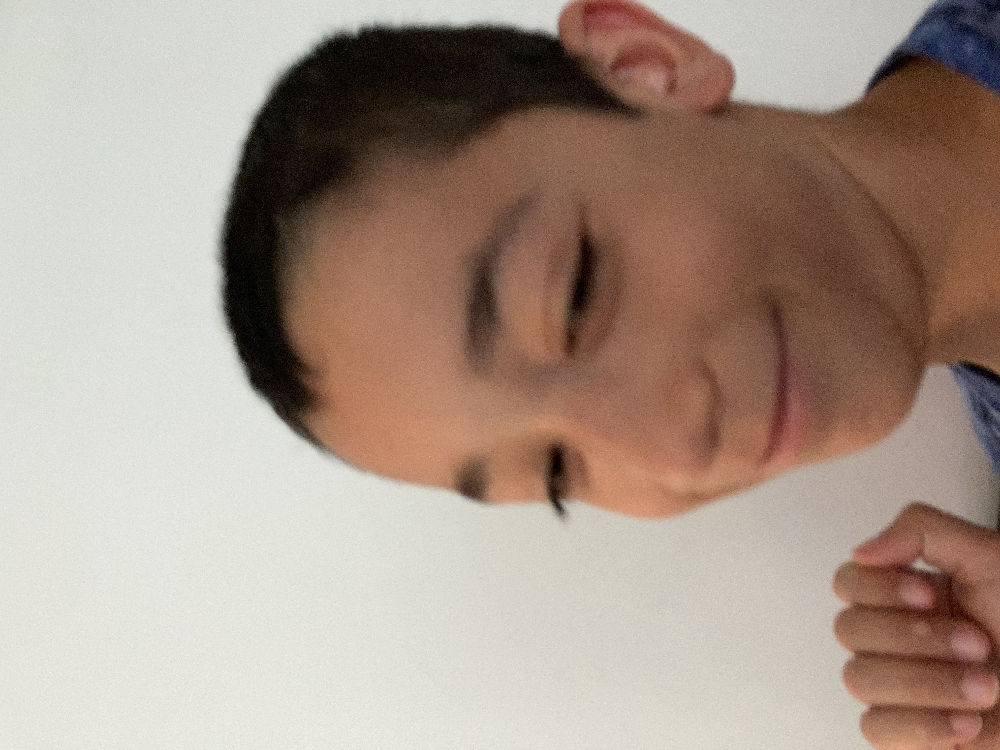

# FlicksByNick — Sports Photography Website

## Folder Structure

```
flicksbynick/
├── index.html          ← Main HTML file (all pages)
├── css/
│   └── style.css       ← All custom styles
├── js/
│   └── main.js         ← Page navigation, gallery filter, contact form
├── images/
│   ├── hero.jpeg           ← Football hero banner (IMG_3629)
│   ├── wrestling.jpeg      ← Wrestling shot (DSC_0486)
│   ├── football-action.jpeg ← Football action (IMG_3652)
│   ├── basketball.jpeg     ← Basketball shot (11-CSC_0961)
│   └── football-sideline.jpeg ← Sideline shot (IMG_3632)
└── README.md
```

## Tech Stack

- **HTML5** — semantic structure
- **Bootstrap 5.3** — grid, navbar, responsive layout (via CDN)
- **Bootstrap Icons 1.11** — icons (via CDN)
- **Custom CSS** — design system, animations, all custom components
- **Vanilla JS** — page switching, gallery filter, form handling
- **Google Fonts** — Bebas Neue + DM Sans (via CDN)

## How to Run

1. Open the folder in VS Code
2. Install the **Live Server** extension (if you haven't)
3. Right-click `index.html` → **Open with Live Server**
4. Done — opens at `http://localhost:5500`

> **No build step needed.** Pure HTML/CSS/JS.

## Pages

| Page       | Description                                      |
|------------|--------------------------------------------------|
| Home       | Hero, Featured Work grid, About preview, CTA     |
| About      | Portrait placeholder, bio, stats, inspiration    |
| Galleries  | Filterable 3-col grid (all placeholders)         |
| Contact    | Form + contact info + social links               |
| Mobile     | Two phone frame mockups side by side             |

## Adding Real Gallery Photos

When you're ready to add real images to the gallery, replace the placeholder `<div class="gallery-item-inner">` blocks in `index.html` with:

```html
<div class="gallery-item" data-cat="football">
  
  <div class="gallery-watermark"><span>FlicksByNick</span></div>
  <div class="gallery-sport-tag">Football</div>
</div>
```

## Adding a Real Headshot

Find the `portrait-placeholder` and `about-img-frame` divs in `index.html` and replace with:

```html

```

## Color Palette

| Variable       | Value     | Usage              |
|----------------|-----------|--------------------|
| `--black`      | `#0a0a0a` | Background         |
| `--dark`       | `#111111` | Section backgrounds|
| `--gold`       | `#E8B84B` | Accent / brand     |
| `--white`      | `#F8F6F1` | Text               |
| `--muted`      | `#8a8a8a` | Secondary text     |
